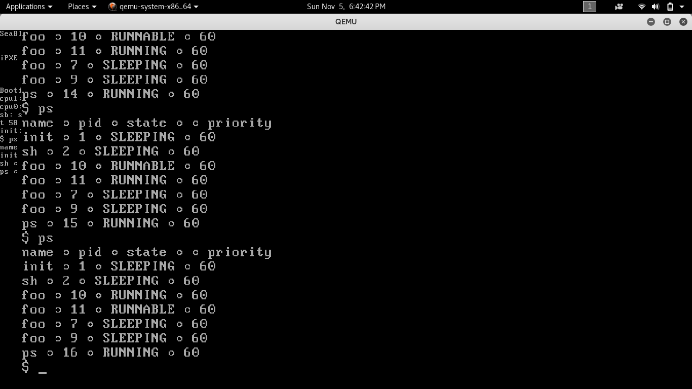
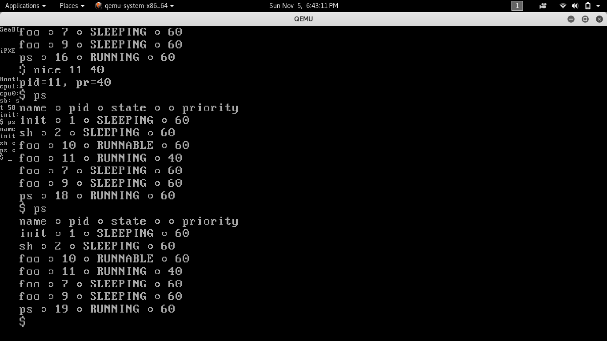

#### Roll Number - 20161035
#### OS Assignment 5

* Priority Based Scheduler - Priority scheduling involves priority assignment to every process, and processes with higher priorities are carried out first, whereas tasks with equal priorities are carried out on round robin basis.

* Made 2 files **foo.c** (Its forking new processes for testing by doing useless calculations) and **nice.c**
(Its used to set priority according to the mentioned pid).

#### Comparison between Round Robin and Priority based scheduler on the basis of starvation

* Round robin allocates time slices to each process in a cyclic manner and stops starvation.
* Priority based scheduling may cause starvation because **high priority** (low number) processes will
  given be given preference over **low priority** (high number) processes.
* With same priority proesses, Round robin scheduler is used.

#### Round Robin

#### Priority Based

#### Useful Links:-

